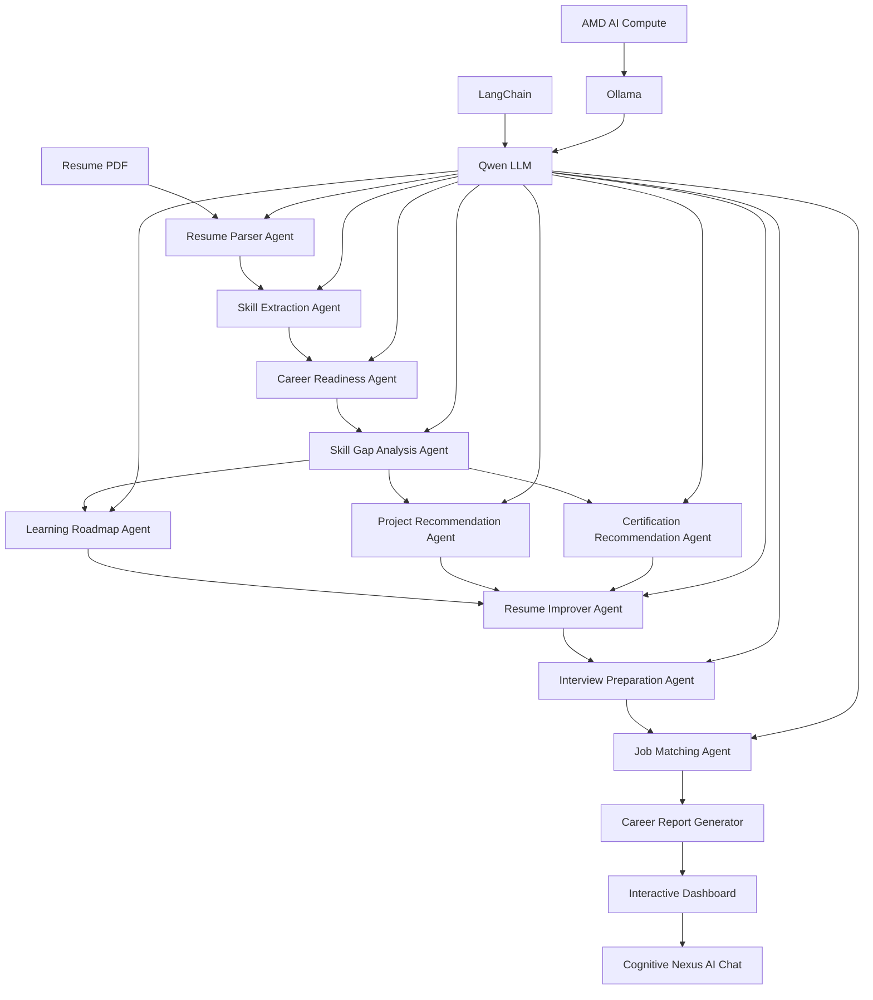

<p align="center">
  
</p>

# Cognitive Nexus

### Multi-Agent Career Intelligence System

Built using **LLMs • LangChain • Ollama • AMD AI Compute**


## 📖 Overview

**COGNITIVE NEXUS** is a **Multi-Agent Career Intelligence System** built using **LLMs, LangChain, Ollama (Qwen)** and **AMD AI Compute**.

The system acts as an autonomous AI career mentor by orchestrating multiple specialized AI agents that work together to analyze resumes, identify technical and soft skills, calculate career readiness, detect skill gaps, recommend personalized learning roadmaps, suggest projects and certifications, prepare interview questions, match job roles, and generate a comprehensive career report.

Unlike traditional resume analyzers, Cognitive Nexus follows an **Agentic AI architecture**, where each agent is responsible for a dedicated task while collaborating with other agents to deliver intelligent, structured, and personalized end-to-end career guidance.


# ✨ Key Features

- 📄 Intelligent Resume Parsing
- 🧠 AI-powered Skill Extraction
- 📊 Career Readiness Score
- 🔍 Skill Gap Detection
- 🗺️ Personalized Learning Roadmap
- 💡 AI Project Recommendation
- 🎓 Certification Recommendation
- 📝 Resume Improvement Suggestions
- 🎤 Interview Preparation Agent
- 💼 Job Matching Agent
- 📈 Interactive Visualizations
- 📑 Professional PDF Report Generation
- 🤖 Multi-Agent AI Pipeline
- 💬 AI Career Chat Assistant
- ⚡ Powered by Ollama + Qwen LLM
- 🔒 Local AI Processing for improved privacy


# 🎯 Problem Statement

Students often struggle to understand how well their resumes align with industry expectations.

They may not know:

- Which skills they are missing for their target role
- Which technologies they should learn next
- Which projects can strengthen their profile
- Which certifications are relevant
- How to improve their resume
- How prepared they are for technical interviews
- Which career opportunities best match their current skills

Traditional resume analyzers generally focus on ATS scoring or resume feedback, but they do not provide a complete and personalized career development strategy.

**COGNITIVE NEXUS** addresses this problem by using a collaborative **Multi-Agent AI system** that analyzes resumes, identifies skill gaps, recommends learning resources, projects and certifications, prepares interview questions, and generates a personalized career roadmap.


# 💡 Our Solution

Cognitive Nexus transforms a simple resume into an intelligent career development plan.

The system follows an end-to-end workflow:

```text
Resume Upload
      ↓
Resume Parsing
      ↓
Skill Extraction
      ↓
Career Readiness Analysis
      ↓
Skill Gap Detection
      ↓
Learning Roadmap
      ↓
Project Recommendations
      ↓
Certification Recommendations
      ↓
Resume Improvement
      ↓
Interview Preparation
      ↓
Job Matching
      ↓
Career Report + Dashboard + AI Chat

```

# 🛠 Tech Stack

| Category             | Technologies       |
| -------------------- | ------------------ |
| Programming Language | Python             |
| LLM                  | Qwen               |
| Framework            | LangChain          |
| LLM Runtime          | Ollama             |
| Notebook Environment | Jupyter Notebook   |
| Data Processing      | Pandas, NumPy      |
| Visualization        | Matplotlib, Plotly |
| PDF Processing       | PDFPlumber, PyPDF  |
| Report Generation    | FPDF, ReportLab    |
| Vector Search        | FAISS              |
| AI Platform          | AMD AI Compute     |

## 🏗️ System Architecture



# 📸 Project Screenshots

## 🏠 Dashboard


---

## 📄 Resume Analyzer


---

## 🤖 AI Chat


---

## 📈 Placement Progress Analytics


---

## 🧠 Skills Breakdown


---

## 💡 AI Suggestions


---

## 📋 Daily Tasks


---

## 👤 Profile Dashboard


---

## 📄 Resume Parsing Agent


---

## ⚙ Backend Running


---

## 💬 Cognitive Nexus AI Conversation


# 🚀 Installation

## Clone Repository

```bash
git clone https://github.com/AnkushRana528/Cognitive-Nexus.git

cd Cognitive-Nexus
```

## Install Dependencies

```bash
pip install -r requirements.txt
```

## Start Ollama

```bash
ollama serve
```

## Pull the Model

```bash
ollama pull qwen3:4b
```

## Launch Jupyter

```bash
jupyter notebook
```

Open

```
notebooks/00_master_pipeline_(2).ipynb
```

Run all cells.

# 👥 Team

## Team Lead

**Ankush Rana**

## Team Members

- Ashish Kumar
- Saransh Arora
- Harmandeep Kaur

Institution:
Maharishi Markandeshwar (Deemed to be University)


